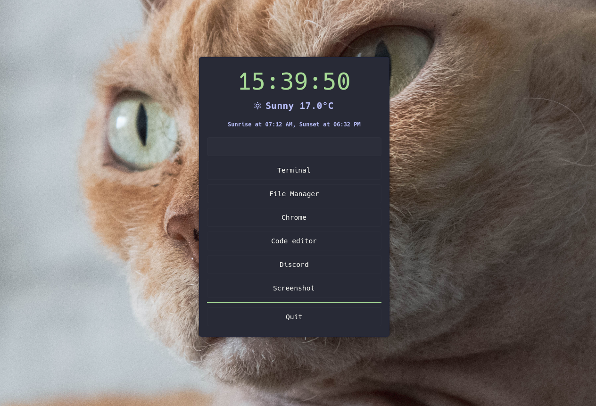

# Oscar - One Simple Configurable Action Runner
Oscar is a simple and configurable launcher that allows you to quickly execute commands, launch applications, or display the output of Bash scripts. 

It's designed to be flexible, easy to configure, yet simple enough making it perfect for those who love to customize their workflow.

## Why
I always struggled to configure Rofi (and similar other) to my liking, it felt way too complicated.

I also wanted to try to develop in Python and to play with GTK4.

I now use `oscar` for everything, i removed my status bar and rofi.

This is what my desktop look like (Oh and meet my cat ... `oscar`)




## Installation
There is no installation script yet, for now, you can just copy the script and make it executable.

Don't forget to install Python3 and GTK4.

```bash
copy ./src/oscar /usr/local/bin
chmod +x /usr/local/bin/oscar
```

You will also need to copy the default configuration file into `~/.config/oscar/`

```bash
mkdir -p ~/.config/oscar
copy -r ./.config/oscar ~/.config/oscar
```


## Usage
Simply run `oscar` to open the default configuration, or run `oscar :name:` to open a specific configuration

## Configuration
Create a new configuration file `:name.json` into `~/.config/oscar`.

- **title** (optional) : Name displayed in the "header" (default: empty , no header displayed)
- **width** (optional) : Width of the window (default: `300`)
- **height** (optional) : Height (minimum) of the window (default: `0`)
- **timeout** (optional) : Close the window after some time (in seconds, default: `0` ... will not close automaticly)
- **theme** (optional) : Choose a theme for the window, (default: `default`)
- **orientation** (optional) : Orientation  `horizontal` or `vertical` (default: `vertical`)
- **items**: A list of [items](#items)
- **application_title** (optional) : A way to put a custom title to the window, i added this for further customization with my Destkop Manager (see [issues](#issues) for more detail) (default: `oscar`)

```json
{
    "title": "Title",
    "width": 400,
    "height": 0,
    "timeout": 0,
    "theme": "default",
    "orientation": "vertical",
    "items": []
}
```

## items

### Runner
Runner allow you to run a command manually
- **type** : `runner`
- **label** (optional) : Label on top of the input
- **class_name** (optional) : Name of a CSS class for stylingwindow
```json
{
    "type": "runner",
    "label": "Run a command",
    "class_name": "runner"
}
```

### Button
Button is the more usefull one
- **type** (optional) : default `button`
- **label** (optional) : Label of the button
- **shortcut** (optional) : One character you can use as a shortcut once the window is open
- **class_name** (optional) : Name of a CSS class for styling
- **command** (optional) : A command to run, leave it empty if you want to quit the window
```json
{
    "type": "button",
    "label": "Oscar Github page",
    "shortcut": "o",
    "class_name": "firefox",
    "command": "firefox https://github.com/dimitri-gigot/oscar"
}
```


### Output
Output is usefull if you want to display information.

For example, this show the time and it run every second.

- **type** : `output`
- **label** (optional) : Label, it will be replace by the output of the command
- **class_name** (optional) : Name of a CSS class for styling
- **interval** : Define some interval to run the command again (default: `0`)
- **command** : A command to run

```json
{
    "type": "output",
    "label": "Clock",
    "class_name": "clock",
    "interval": 1,
    "command": "echo $(date '+%H:%M:%S')"
}
```


### Group
Group other items together

- **type** : `group`
- **class_name** (optional) : Name of a CSS class for styling
- **items**: A list of [items](#items)
- **orientation** (optional) : Orientation  `horizontal` or `vertical` (default: `horizontal`)
```json
{
    "type": "group",
    "class_name": "group",
    "items": [],
    "orientation": "horizontal"
}
```


### Separator
Display a separator line

- **type** : `separator`
- **class_name** (optional) : Name of a CSS class for styling

```json
{
    "type": "separator",
    "class_name": "separator"
}
```

## Theme
You can use CSS to theme `oscar`

Every component has a specific class_name by default, the class_name you defined in the configuration is added.

The name of the configuration is also added to `.window` as such `.window.default` for the default configuration.

```
 _ .window
 |_ .header
 |_ .box
    |_ .item
```

To create a new theme, create a new file in `~/.config/oscar/themes/:theme_name/style.css`.


## Issues

Depending on your Desktop Manager, it might not open in a floating window.

In my `hyprland` configuration i had to add rules to target the title of the window like this:
```
windowrulev2 = float, title:oscar
windowrulev2 = stayfocused, title:oscar
```
